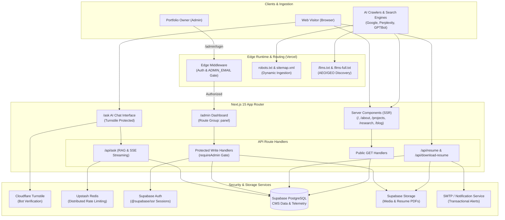

<div align="center">

# Vedaang Sharma — Portfolio Platform

### A full-stack, CMS-driven portfolio platform with an interactive AI assistant, automated SEO/AEO/GEO engine, secure admin dashboard, role-based authorization, and production-grade security hardening.

[](https://vedaangsharma.in)
[](LICENSE)


</div>

---

## Overview

**Vedaang Sharma Portfolio** is not a static personal website — it is a modern, full-stack content and intelligence platform. The public-facing site (projects, research, blog, certifications, experience, and interactive AI) is driven entirely by a **custom CMS** behind a secure admin dashboard, allowing every piece of content to be created, edited, and published **without touching code or redeploying**.

The platform is engineered with **Next.js 15 (App Router)** and **React 19**, backed by **Supabase** for PostgreSQL, authentication, and object storage. It integrates an **in-house RAG-grounded AI conversational assistant (`/ask`)**, a complete **SEO + AEO + GEO optimization layer** (with machine-readable `/llms.txt` discovery files and rich JSON-LD graph schemas), **Cloudflare Turnstile bot verification**, **single-admin edge authorization**, **magic-byte validated file uploads**, **Upstash Redis distributed rate limiting**, and an **AVIF/WebP image pipeline** — deployed on **Vercel** with **PostHog** analytics and **Vercel Speed Insights**.

> **Engineering Principle:** Build personal software with the same rigor as a production SaaS product — secure, observable, performant, entity-consistent, and operable without developer intervention.

---

## Why I Built This

Most portfolio websites hardcode content into static JSX components. Every project, paper, or résumé update requires a commit and build deployment.

I engineered this platform to solve real software engineering challenges:

1. **Decoupled Architecture:** Content lives in managed PostgreSQL and Supabase Storage; presentation remains modular in Next.js Server Components.
2. **No-Deploy Operations:** Content updates, blog drafts, and credential management are performed instantly via the admin dashboard.
3. **AI Search & Answer Engine Optimization (AEO / GEO):** Beyond traditional meta tags, modern web discovery requires semantic entity graphs, Schema.org microdata, and structured `/llms.txt` feeds for LLMs and AI search engines (Perplexity, ChatGPT, Copilot, Gemini).
4. **Production Security & Abuse Prevention:** Unprotected forms and endpoints invite scrapers and mail abuse. Integrating Cloudflare Turnstile, distributed rate limiting, and strict input validation demonstrates defensive engineering in practice.
5. **Grounded AI Interaction:** The portfolio embeds a first-person AI assistant grounded strictly in verified repository facts, demonstrating practical RAG and agent workflow design.

---

## Key Features

### 1. Interactive AI Assistant ("Ask Vedaang" / `/ask`)
- **What:** A conversational AI assistant grounded strictly in portfolio knowledge, resume facts, case studies, and academic publications.
- **Why:** Allows recruiters, engineers, and visitors to query projects, architectures, and technical skills interactively.
- **Value:** Implements domain normalization, knowledge aggregation (`lib/knowledge/aggregate.ts`), streaming responses, and strict guardrails preventing hallucinations. Protected by Cloudflare Turnstile bot verification.

### 2. Full-Stack Content Management System (CMS)
- **What:** An authenticated dashboard managing Projects, Categories, Skills, Experience, Education, Research, Certifications, Blog Posts, Socials, and Global Settings.
- **Why:** Eliminates the need to redeploy code for content changes.
- **Value:** Complete CRUD workflows across 10 resource types with typed database mappers and optimistic UI updates.

### 3. Production SEO, AEO & GEO Optimization Engine
- **What:** Complete search and answer engine optimization infrastructure:
  - **Single Source of Truth (`lib/seo/config.js`):** Authoritative centralized configuration ensuring strict entity consistency.
  - **JSON-LD Schema Graph (`lib/seo/schema.js`):** Rich structured data for `Person`, `WebSite`, `ProfilePage`, `FAQPage`, `ItemList`, `EducationalOccupationalCredential`, `BreadcrumbList`, `SoftwareApplication`, `ScholarlyArticle`, and `BlogPosting`.
  - **LLM Discovery Feeds (`/llms.txt` & `/llms-full.txt`):** Structured markdown specifications per `llmstxt.org` for answer engines and generative AI agents.
  - **Dynamic Sitemap (`app/sitemap.js`):** Server-rendered sitemap automatically synchronizing live projects, published articles, and research papers from PostgreSQL.
  - **Modern Robots Directive (`app/robots.js`):** Crawl rules permitting search engines and verified AI crawlers (GPTBot, ClaudeBot, PerplexityBot) while strictly protecting `/admin`, `/api/`, and `/ask`.
  - **Visible Synchronized FAQs:** Interactive FAQ on `/about` backed by inline Schema.org microdata matching JSON-LD schemas with zero hidden text.

### 4. Cloudflare Turnstile Bot Defense
- **What:** Invisible and interaction-based CAPTCHA alternative via Cloudflare Turnstile.
- **Why:** Protects public write endpoints (contact forms, resume downloads, chat assistant) from automated bots and scraping without user friction.
- **Value:** Server-side token validation via Cloudflare Siteverify API before fulfilling requests.

### 5. Single-Admin Authorization & Edge Middleware
- **What:** Single-admin model where only the verified email in `ADMIN_EMAIL` receives administrative privileges.
- **Why:** "Logged in" must never equal "authorized."
- **Value:** Edge middleware guards all `/admin/*` routes. Every write API independently enforces `requireAdmin()` with defense-in-depth authorization.

### 6. Secure Upload System & Supabase Storage
- **What:** Authenticated file uploads with magic-byte content inspection, strict MIME allowlists (JPEG, PNG, WebP, AVIF, PDF), size limits (5 MB images, 10 MB PDFs), and server-generated UUID filenames.
- **Why:** Prevents stored XSS, polyglot file attacks, and path traversal.
- **Value:** Safe binary handling decoupling structured data from media storage.

### 7. Résumé Telemetry & Access Tracking
- **What:** Server-side download endpoint logging download events (approximate country/city via IP geolocation, ISP, timestamp, user agent) with automated transactional email notifications.
- **Why:** Provides visibility into hiring and collaboration interest while respecting user privacy (no GPS or invasive tracking).
- **Value:** Integrates background transactional notifications via Nodemailer/SMTP/Resend with PostgreSQL storage.

### 8. Dynamic Open Graph & Social Cards
- **What:** Edge-rendered social share previews generated dynamically via `next/og` from query parameters and article metadata.
- **Why:** Ensures every project, post, and research paper has tailored, high-resolution social previews across Twitter/X, LinkedIn, and Discord.
- **Value:** Low-latency dynamic image synthesis running on Vercel Edge Runtime.

### 9. Upstash Redis Distributed Rate Limiting
- **What:** Sliding-window rate limiter on unauthenticated public routes (contact submissions, chat interactions) backed by Upstash Redis, with graceful memory-based fallback.
- **Why:** Prevents spam, denial-of-service, and resource exhaustion on serverless functions.
- **Value:** Stateful rate limiting across stateless serverless instances.

### 10. Design System & Performance Engineering
- **What:** Modern dark/light theme engine using CSS variables and Tailwind CSS 4 custom variants, Framer Motion springs, accessible typography, and an AVIF/WebP image pipeline powered by Sharp.
- **Why:** High visual fidelity with fast load times (Core Web Vitals discipline).
- **Value:** Server Components reducing client JS bundles, zero flash of unstyled theme (THEME_INIT_SCRIPT), and smooth micro-animations.

---

## Architecture Overview



---

## Security Architecture & Controls

| Security Control | Implementation Mechanism | Purpose |
|---|---|---|
| **Edge Authorization Gate** | Next.js Edge Middleware (`middleware.js`) | Validates Supabase session and enforces `ADMIN_EMAIL` match before serving `/admin/*` routes. |
| **Defense-in-Depth Write Checks** | `lib/auth/requireAdmin.js` | Independently re-verifies authentication and admin allowlist on every `POST`/`PUT`/`DELETE` handler. |
| **Bot Verification** | Cloudflare Turnstile (`lib/turnstile.js`) | Protects contact inquiries, chat assistant, and resume download actions from automated scripts. |
| **Distributed Rate Limiting** | Upstash Redis + `@upstash/ratelimit` | Enforces sliding-window request throttling across serverless instances (with in-memory fallback). |
| **Magic-Byte Content Validation** | `lib/upload/validateUpload.js` | Inspects binary file signatures; rejects disguised executable files, scripts, or invalid MIME types. |
| **Server-Generated Filenames** | UUIDv4 + Timestamp Hashing | Prevents path traversal and filename collisions in Supabase Storage. |
| **HTTP Security Headers** | `next.config.js` | Implements HSTS (2 years), `X-Frame-Options: DENY`, `X-Content-Type-Options: nosniff`, Referrer-Policy, and Permissions-Policy. |
| **Content Security Policy (CSP)** | Scoped Report-Only / Strict Directives | Restricts script, style, connect, and image sources to approved origins. |
| **Honeypot Spam Defense** | Hidden Form Trap | Silently drops automated bot form submissions that populate invisible honeypot inputs. |
| **Data Privacy & Telemetry Guard** | Supabase Row Level Security (RLS) | Telemetry and admin tables are inaccessible publicly; queries flow through server-side authenticated clients. |

---

## Technical Stack & Dependencies

```
┌────────────────────────────────────────────────────────────────────────┐
│                              FRONTEND                                  │
│  Next.js 15 (App Router) • React 19 • Tailwind CSS 4 • Framer Motion   │
│  FontAwesome 6 • NProgress • Jost & Poppins (next/font)               │
└────────────────────────────────────┬───────────────────────────────────┘
                                     │
┌────────────────────────────────────▼───────────────────────────────────┐
│                              BACKEND                                   │
│  Next.js API Route Handlers (Node.js & Edge Runtime)                  │
│  Knowledge Normalizer & Aggregator • RAG Answer Engine                 │
│  Nodemailer • IP Geolocation Resolution                                │
└────────────────────────────────────┬───────────────────────────────────┘
                                     │
┌────────────────────────────────────▼───────────────────────────────────┐
│                        INFRASTRUCTURE & DATA                           │
│  Supabase PostgreSQL • Supabase Auth (@supabase/ssr)                  │
│  Supabase Storage • Upstash Redis • Cloudflare Turnstile               │
│  Sharp (Image Processing) • PostHog Analytics • Vercel Analytics       │
└────────────────────────────────────────────────────────────────────────┘
```

---

## Repository Structure

```
.
├── app/
│   ├── (root)/                 # Home landing page (Hero, Previews, Teasers, Contact CTA)
│   ├── about/                  # Bio, Experience, Education, Visible Schema-Backed FAQ
│   │   └── components/         # Modular About sections (about, education, experience, faq)
│   ├── projects/               # Projects showcase, ItemList schema
│   │   ├── [slug]/             # Dynamic project detail (Metadata, SoftwareApplication schema)
│   │   └── archive/            # Historical project archive
│   ├── research/               # Academic publications & Research showcase
│   │   └── [slug]/             # ScholarlyArticle schema, publication details
│   ├── blog/                   # Technical blog posts & Topic filtering
│   │   └── [slug]/             # BlogPosting schema, article view
│   ├── skills/                 # Comprehensive technical skill matrix
│   │   └── components/         # Interactive skill categories & proficiencies
│   ├── certifications/         # Verified credentials & EducationalOccupationalCredential schemas
│   ├── contact/                # Contact form with Turnstile & rate limiting
│   ├── privacy/                # Privacy policy, telemetry disclosures
│   ├── ask/                    # "Ask Vedaang" AI Assistant interface (robots: noindex)
│   ├── admin/                  # Admin surface (robots: noindex)
│   │   ├── login/              # Admin login interface
│   │   └── (panel)/            # Protected CMS dashboard routes (projects, blog, settings, etc.)
│   ├── api/                    # Route handlers (REST endpoints)
│   │   ├── ask/                # AI assistant conversational endpoint (streaming SSE)
│   │   ├── contact/            # Turnstile-verified contact handler
│   │   ├── resume/             # Secure resume download & telemetry logger
│   │   ├── upload/             # Magic-byte validated media upload handler
│   │   └── [entities]/         # CRUD handlers for projects, research, blog, skills, etc.
│   ├── robots.js               # Dynamic robots.txt with search & AI bot directives
│   ├── sitemap.js              # Dynamic XML sitemap generator
│   └── layout.jsx              # Root layout (Person & WebSite JSON-LD, Fonts, Theme init)
├── components/                 # Shared UI (Navbar, Footer, AuroraBackground, FlyRankBadge, etc.)
├── lib/
│   ├── ask/                    # AskEngine reasoning and prompt grounding logic
│   ├── auth/                   # requireAdmin & single-admin authorization utilities
│   ├── knowledge/              # Dynamic repository knowledge aggregator & normalizer
│   ├── seo/                    # Centralized SEO config (config.js) & JSON-LD generators (schema.js)
│   ├── supabase/               # Browser, SSR, and Service-Role Supabase clients + mappers
│   ├── upload/                 # Magic-byte file validation rules
│   ├── rateLimit.js            # Upstash Redis sliding-window rate limiter
│   └── turnstile.js            # Cloudflare Turnstile token validation
├── public/
│   ├── llms.txt                # Machine-readable LLM summary index
│   ├── llms-full.txt           # Extended knowledge base for AI answer engines
│   └── image/                  # Static media and assets
├── next.config.js              # Security headers, CSP, Sharp optimization, bundle analyzer
└── README.md                   # Platform documentation
```

---

## Environment Variables

| Variable | Scope | Description |
|---|---|---|
| `NEXT_PUBLIC_SITE_URL` | 🌐 Public | Canonical domain URL (`https://vedaangsharma.in`). |
| `NEXT_PUBLIC_SUPABASE_URL` | 🌐 Public | Supabase project API gateway. |
| `NEXT_PUBLIC_SUPABASE_ANON_KEY` | 🌐 Public | Anonymous key for client-side queries bound by RLS. |
| `SUPABASE_SERVICE_ROLE_KEY` | 🔒 Server-only | Privileged service key for admin CMS writes and secure operations. |
| `ADMIN_EMAIL` | 🔒 Server-only | Verified email address authorized for `/admin` access. |
| `NEXT_PUBLIC_TURNSTILE_SITE_KEY`| 🌐 Public | Cloudflare Turnstile public site key. |
| `TURNSTILE_SECRET_KEY` | 🔒 Server-only | Cloudflare Turnstile secret validation key. |
| `UPSTASH_REDIS_REST_URL` | 🔒 Server-only | REST endpoint for Upstash Redis distributed rate limiting. |
| `UPSTASH_REDIS_REST_TOKEN` | 🔒 Server-only | Auth token for Upstash Redis. |
| `SMTP_HOST` / `SMTP_PORT` | 🔒 Server-only | SMTP server configuration for contact and alert notifications. |
| `SMTP_USER` / `SMTP_PASS` | 🔒 Server-only | SMTP authentication credentials. |
| `SMTP_TO` | 🔒 Server-only | Destination inbox for inquiries and download telemetry alerts. |

---

## Local Development

### Prerequisites
- **Node.js 20+**
- **pnpm** (or npm)
- **Supabase Account** with PostgreSQL database and `images` storage bucket
- *(Optional)* **Upstash Redis** & **Cloudflare Turnstile** accounts

### Setup Steps
```bash
# 1. Clone repository
git clone https://github.com/gtathelegend/Vedaang-Sharma-Portfolio.git
cd Vedaang-Sharma-Portfolio

# 2. Install dependencies
pnpm install

# 3. Configure environment variables
cp .env.example .env.local
# Populate .env.local with your Supabase, Turnstile, and SMTP keys

# 4. Start local development server (Turbopack)
pnpm dev

# 5. Run linting & production build validation
pnpm lint
pnpm build
```

---

## License

This project is open-sourced under the **GNU General Public License v3.0 (GPL-3.0)**.  
See the [LICENSE](LICENSE) file for complete details.

> Copyright © 2025–2026 Vedaang Sharma. All rights reserved.

---

<div align="center">

**[🌐 Official Website](https://vedaangsharma.in)** · **[💼 LinkedIn](https://www.linkedin.com/in/vedaangsharma2006/)** · **[🐙 GitHub](https://github.com/gtathelegend)**

</div>
