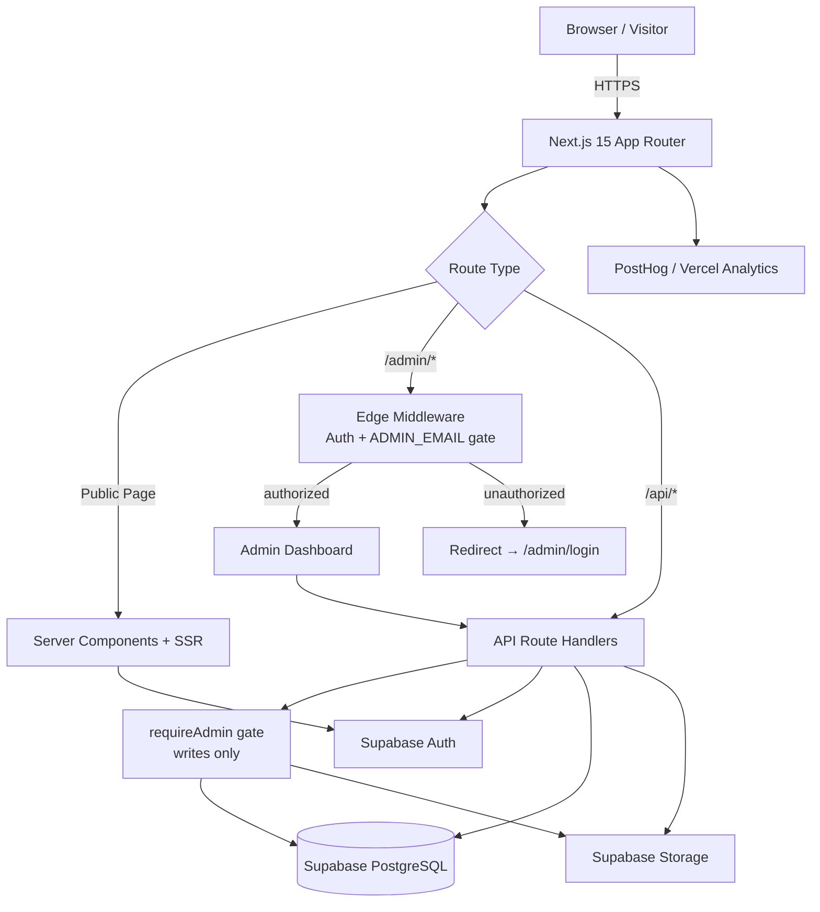

<div align="center">

# Vedaang Sharma — Portfolio Platform

### A full-stack, CMS-driven portfolio platform with a secure admin dashboard, role-based authorization, and production-grade security hardening.

[](https://vedaangsharma.dev)
[](LICENSE)


</div>

---

## Overview

**Vedaang Sharma Portfolio** is not a static personal site — it is a full-stack content platform. The public-facing site (projects, research, blog, certifications, experience, and more) is driven entirely by a **custom CMS** behind a secure admin dashboard, so every piece of content can be created, edited, and published **without touching code or redeploying**.

The platform is built on **Next.js 15 (App Router)** and **React 19**, backed by **Supabase** for PostgreSQL, authentication, and object storage. It ships with **single-admin authorization**, **middleware-protected routes**, **validated file uploads**, **rate-limited and bot-protected forms**, a hardened **HTTP security header policy**, edge-rendered **dynamic Open Graph images**, and a tuned **AVIF/WebP image pipeline** — deployed on **Vercel** with **PostHog** product analytics and **Vercel Speed Insights**.

> The goal: demonstrate that a portfolio can be engineered like a real production SaaS product — secure, observable, performant, and operable by a non-technical owner.

---

## Why I Built This

Most portfolio sites hardcode their content directly into components. Every new project, blog post, or résumé update means editing JSX, committing, and redeploying. That couples *content* to *engineering* — the worst kind of coupling for something that changes weekly.

I wanted to solve this the way a product team would:

- **Traditional portfolios are limiting.** Static content rots. The moment updating your work feels like a chore, it stops happening. Content should live in a database, not a Git commit.
- **A CMS-driven architecture decouples content from code.** The presentation layer stays stable while content flows through a typed API and a managed Postgres database. The site becomes a *platform*, not a *page*.
- **Content should be editable without redeployment.** Adding a project should take 30 seconds in an admin panel, not a build pipeline. This is a real operational requirement for any content-heavy product.
- **Building full-stack delivers more engineering value.** Anyone can style a landing page. Designing an authenticated CMS — with authorization boundaries, a service-role security model, validated uploads, and abuse protection — exercises the skills that actually matter in production software.

This project is the result: a portfolio that doubles as a demonstration of full-stack architecture, security engineering, and production operability.

---

## Key Features

Each feature below lists **what it does**, **why it exists**, and the **engineering value** it demonstrates.

### Content Management System
- **What:** A full admin CMS that manages projects, categories, skills, experience, education, research, certifications, blog posts, social links, and global site settings.
- **Why:** Content changes constantly; code shouldn't have to.
- **Value:** End-to-end CRUD across many resource types, all flowing through a consistent API and data-mapping layer.

### Authentication
- **What:** Email/password sign-in via Supabase Auth with cookie-based SSR sessions.
- **Why:** The admin surface must be private.
- **Value:** Correct server-side session handling with `@supabase/ssr` across middleware, server components, and route handlers.

### Authorization
- **What:** A single-admin model — only the email in `ADMIN_EMAIL` is treated as an administrator, enforced in both middleware and every write route.
- **Why:** "Logged in" must never equal "authorized." Any Supabase account existing should not grant admin power.
- **Value:** A clean authorization boundary independent of authentication.

### Project Management
- **What:** Create and edit projects with tech stack, categories, images, links, and long-form engineering notes (problem statement, architecture, decisions, lessons learned).
- **Why:** Projects are the core artifact of an engineering portfolio.
- **Value:** Models rich, structured content rather than flat text.

### Image Upload System
- **What:** Authenticated uploads with MIME allowlists, file-size caps, magic-byte content verification, and server-generated filenames.
- **Why:** Public buckets are a classic stored-XSS and abuse vector.
- **Value:** Defense-in-depth file handling that rejects spoofed and malicious files.

### Supabase Storage Integration
- **What:** Images and the résumé PDF are stored in Supabase Storage and served via optimized public URLs.
- **Why:** Binary assets don't belong in a Git repo or a database.
- **Value:** Proper separation of structured data and object storage.

### Dynamic Open Graph Images
- **What:** Share cards are generated on demand at the edge via `next/og` from query parameters.
- **Why:** Every page deserves a tailored social preview without manual design work.
- **Value:** Edge runtime rendering and dynamic image generation.

### SEO Optimization
- **What:** Metadata templates, Open Graph and Twitter cards, and a generated sitemap.
- **Why:** Discoverability matters for a public portfolio.
- **Value:** Framework-native metadata and crawler-friendly output.

### Analytics
- **What:** PostHog product analytics (reverse-proxied through the app), plus Vercel Analytics and Speed Insights.
- **Why:** You can't improve what you can't measure.
- **Value:** Event instrumentation and real-user performance monitoring.

### Responsive Design
- **What:** Mobile-first layouts with Tailwind CSS 4 and Framer Motion transitions.
- **Why:** Most visitors arrive on mobile.
- **Value:** Accessible, fluid UI across breakpoints.

### Performance Optimization
- **What:** Server Components, an AVIF/WebP image pipeline with Sharp, route-level caching, and bundle analysis.
- **Why:** Speed is a feature and a ranking signal.
- **Value:** Measurable Core Web Vitals discipline.

### Security Hardening
- **What:** Authorization gates, validated uploads, rate limiting, honeypot spam protection, safe error handling, and a full security header policy.
- **Why:** A public, write-capable app is an attack surface.
- **Value:** A security-first mindset applied throughout the stack. *(See [Security Features](#security-features).)*

### Admin Dashboard
- **What:** A unified, route-grouped dashboard for operating the entire platform.
- **Why:** Content owners need one place to work.
- **Value:** Cohesive internal-tooling UX.

### Research Publication Management
- **What:** Manage research interests and papers (venue, year, abstract, areas, DOI, linked project).
- **Why:** Academic and research work needs first-class structure.
- **Value:** Domain modeling beyond generic "posts."

### Certification Management
- **What:** Track certifications with issuer, year, category, and verification URL.
- **Why:** Credentials are part of a professional profile.
- **Value:** Another cleanly modeled, CMS-driven content type.

### Blog Management
- **What:** Author posts and topics with a draft/publish workflow; drafts are never exposed publicly.
- **Why:** Writing in public builds credibility — safely.
- **Value:** A publishing workflow with proper visibility controls.

---

## Security Features

Security is treated as a first-class concern, not an afterthought. Implemented controls:

| Area | Implementation |
| ---- | -------------- |
| **Authentication** | Supabase Auth (email/password) with cookie-based SSR sessions via `@supabase/ssr`. |
| **Admin-only authorization** | Every write/admin operation passes through a shared `requireAdmin()` gate before any privileged work. |
| **Protected admin routes** | Edge middleware guards all `/admin/*` routes and redirects unauthorized users to login. |
| **`ADMIN_EMAIL` allowlist** | Only the configured admin email is authorized — authentication alone never grants admin access. |
| **Secure middleware** | Centralized request-time enforcement with no redirect loops for authenticated non-admins. |
| **Role-based access control** | A clear single-admin role boundary separates public and privileged surfaces. |
| **File upload validation** | Strict per-kind handling for images and the résumé PDF. |
| **Magic-byte verification** | Real file bytes are inspected; declared MIME types that don't match the content are rejected (blocks disguised SVG/HTML/scripts). |
| **MIME-type allowlists** | Images: JPEG, PNG, WebP, AVIF. Documents: PDF. Everything else is rejected. |
| **File size restrictions** | Images ≤ 5 MB, résumé PDF ≤ 10 MB. |
| **Server-generated filenames** | Filenames are created server-side (timestamp + UUID); client filenames are never trusted — prevents path traversal. |
| **Rate limiting** | IP-based throttling on the public contact form (5 requests / 10 minutes) with graceful `429` responses. |
| **Upstash Redis integration** | Distributed rate limiting across serverless instances when configured, with an in-memory fallback otherwise. |
| **Honeypot spam protection** | A hidden field traps bots; flagged submissions are silently dropped. |
| **HSTS** | `Strict-Transport-Security` enforces HTTPS for two years, including subdomains. |
| **Referrer-Policy** | `strict-origin-when-cross-origin` limits referrer leakage. |
| **Permissions-Policy** | Camera, microphone, geolocation, and browsing-topics are disabled. |
| **Content Security Policy** | A scoped CSP ships in **Report-Only** mode for safe tuning before enforcement. |
| **Additional headers** | `X-Frame-Options: DENY`, `X-Content-Type-Options: nosniff`. |
| **Input validation** | Request bodies are length-capped, email-validated, and HTML-escaped before use. |
| **Safe error handling** | Clients receive generic messages; SQL text, database internals, hints, and stack traces are logged server-side only. |
| **Environment variable protection** | Secrets are server-only (no `NEXT_PUBLIC_` prefix) and never reach the client bundle. |
| **Service-role security boundary** | The RLS-bypassing service-role key is used only after `requireAdmin()` for writes, and for public-data-only reads — documented at the source. |

---
## Architecture Overview



### Data Flow

- **Public visitors** request pages that are server-rendered. Public content is read through the data layer and returned as JSON via `/api/*` or fetched directly in Server Components. No privileged credentials are ever exposed.
- **Authenticated admin** signs in through Supabase Auth. The session cookie is validated at the edge by middleware, which additionally checks the email against `ADMIN_EMAIL` before allowing any `/admin/*` access.
- **File uploads** are sent to authenticated API routes that validate type, size, and content (magic bytes) before storing the file in Supabase Storage under a server-generated name.
- **Content management** flows through write API routes. Each one calls `requireAdmin()` first, then performs the mutation using the service-role client (which bypasses Row Level Security) — so the authorization gate, not RLS, is the trust boundary for writes.
- **API requests** are consistent: GET handlers serve public data; POST/PUT/DELETE handlers are admin-gated and return safe, generic errors while logging full detail server-side.

---

## Tech Stack

| Category | Technologies |
| -------- | ------------ |
| **Frontend** | Next.js 15 (App Router), React 19, Tailwind CSS 4, Framer Motion, FontAwesome |
| **Backend** | Next.js API Route Handlers (Node & Edge runtimes) |
| **Database** | Supabase PostgreSQL |
| **Authentication** | Supabase Auth (`@supabase/ssr`) |
| **Storage** | Supabase Storage |
| **Analytics** | PostHog, Vercel Analytics, Vercel Speed Insights |
| **Performance** | Sharp, AVIF/WebP pipeline, Server Components, edge runtime, `@next/bundle-analyzer` |
| **Security** | Upstash Redis (rate limiting), security headers, CSP (Report-Only) |
| **Deployment** | Vercel |
| **Developer Tooling** | ESLint 9, Turbopack (dev), pnpm |

---

## Engineering Decisions

**Why Next.js 15?** A single framework for SSR, server components, API routes, edge middleware, and image optimization — eliminating the need to wire together a separate frontend and backend.

**Why the App Router?** Server Components reduce client JavaScript, layouts compose cleanly, and route handlers + middleware live next to the UI they protect. It's the modern, future-facing Next.js model.

**Why React 19?** Latest concurrent features and first-class Server Component support, paired naturally with Next 15.

**Why Supabase?** It provides Postgres, authentication, and object storage as one coherent platform with a typed client. That covers the three hardest backend concerns without operating separate services.

**Why a CMS?** To decouple content from code. Content lives in Postgres and is editable through an admin UI, so the site evolves without builds or deploys.

**Why Vercel?** Native Next.js hosting with edge middleware, automatic HTTPS, preview deployments, and built-in analytics/speed insights — the lowest-friction path to a production deployment.

**Why server-side APIs?** Centralizing data access on the server keeps the service-role key off the client, enforces validation in one place, and provides a stable contract for the UI.

**Why middleware-based route protection?** Authorization runs at the edge *before* a protected page renders, which is faster and safer than per-page client checks and impossible to bypass from the browser.

**Why rate limiting?** The contact endpoint is public and unauthenticated — without throttling it's an open mail-relay and spam vector. Upstash Redis makes the limit consistent across serverless instances.

**Why secure uploads?** A public storage bucket that accepts arbitrary files is a stored-XSS and abuse risk. Validating MIME, size, and magic bytes — and generating filenames server-side — closes that surface.

---

## Project Structure

```
.
├── app/
│   ├── (root)/                 # Home page (hero, previews, contact)
│   ├── about/                  # Bio, skills, experience, education
│   ├── projects/               # List, [slug] detail, archive
│   ├── blog/                   # Blog index and [slug] post pages
│   ├── research/               # Research index and [slug] pages
│   ├── certifications/         # Certifications showcase
│   ├── skills/                 # Skills showcase
│   ├── contact/                # Contact page
│   ├── now/                    # "/now" status page
│   ├── admin/
│   │   ├── login/              # Standalone login route
│   │   └── (panel)/            # Auth-gated dashboard (route group)
│   │       ├── dashboard/  projects/  categories/  skills/
│   │       ├── experience/ education/ research/     blog/
│   │       └── certifications/ socials/ settings/
│   ├── api/                    # Route handlers (REST)
│   │   ├── projects, categories, skills, experience, education,
│   │   ├── socials, certifications, settings, now, github,
│   │   ├── blog/*, research/*, contact, og, resume,
│   │   ├── upload, upload/resume, auth/logout
│   └── sitemap.js              # Dynamic sitemap
├── components/                 # Shared UI (Navbar, Footer, ContactForm, …)
├── lib/
│   ├── auth/                   # requireAdmin, isAdminEmail (authorization)
│   ├── upload/                 # validateUpload (MIME/size/magic-byte checks)
│   ├── supabase/               # client / server / admin clients + mappers
│   ├── apiError.js             # Safe, centralized error responses
│   ├── rateLimit.js            # Upstash + in-memory rate limiter
│   └── api.js / adminApi.js    # Client fetch helpers
├── middleware.js               # Edge auth + ADMIN_EMAIL gate for /admin/*
├── next.config.js              # Image, headers (CSP/HSTS/…), analyzer, rewrites
└── public/                     # Static assets
```

**Separation of concerns**

- **`app/`** — routing, pages, and the API surface. Public pages and the admin panel are isolated via route groups (`(root)`, `(panel)`).
- **`components/`** — reusable presentation only; no data-access logic.
- **`lib/auth/`** — the single source of truth for authorization, shared by middleware and route handlers.
- **`lib/upload/`** — all file-validation rules in one place, reused by every upload endpoint.
- **`lib/supabase/`** — three clearly-scoped clients (browser, SSR server, service-role admin) plus DB↔API mappers, so credentials and trust levels never blur.
- **`lib/apiError.js` & `lib/rateLimit.js`** — cross-cutting concerns (safe errors, abuse protection) factored out for consistency.
- **`middleware.js`** — request-time authorization at the edge, decoupled from page logic.

---
## Admin Platform

The admin platform is a self-serve CMS that operates the entire public site.

**Authentication flow**
1. The admin signs in at `/admin/login` with Supabase email/password credentials.
2. Supabase issues a session stored in secure cookies.
3. `@supabase/ssr` makes that session available to middleware, server components, and API routes.

**Authorization flow**
1. Edge middleware intercepts every `/admin/*` request and resolves the current user.
2. The user's email is checked against `ADMIN_EMAIL`. Only a match is considered an admin.
3. Unauthorized users are redirected to login; authenticated non-admins are treated as guests (no redirect loop).
4. Every write API route independently re-verifies admin status via `requireAdmin()` — defense in depth, never trusting the client.

**Protected routes** — all dashboard screens live under the `(panel)` route group and are unreachable without passing the middleware gate.

The dashboard manages:

| Module | Capabilities |
| ------ | ------------ |
| **Dashboard** | Central entry point to all content modules. |
| **Project management** | Create/edit projects: tech stack, categories, images, links, and engineering write-ups. |
| **Category management** | Define and order project categories. |
| **Skills management** | Group skills by category and proficiency level. |
| **Experience management** | Roles, companies, dates, descriptions, and skills. |
| **Education management** | Institutions, degrees, achievements, and media. |
| **Research management** | Research interests and papers (venue, year, abstract, DOI, linked project). |
| **Blog management** | Posts and topics with a draft/publish workflow. |
| **Settings management** | Global site identity, bio, SEO metadata, and images. |
| **Image uploads** | Validated uploads to Supabase Storage with instant public URLs. |

**Content publishing workflow** — content is created as structured records in Postgres. Blog posts support an explicit **draft → published** state; unpublished drafts are never returned to public requests (draft access is admin-gated). Updates appear on the live site immediately, with no rebuild or redeploy.

---

## Performance Optimization

- **Next.js optimizations** — App Router with selective static generation and on-demand server rendering per route.
- **Server Components** — data-heavy UI renders on the server, shipping less JavaScript to the browser.
- **Image optimization** — `next/image` with an **AVIF → WebP** format pipeline powered by **Sharp**, plus restricted remote image origins.
- **Caching strategies** — route-level cache headers and revalidation on cacheable endpoints (e.g. GitHub activity and the sitemap).
- **Bundle optimization** — `@next/bundle-analyzer` for monitoring bundle size; production builds strip `console` calls (keeping `error`/`warn`).
- **Dynamic imports** — heavier client widgets are loaded only when needed.
- **Analytics optimization** — PostHog is reverse-proxied through the app to avoid third-party request blocking and keep instrumentation lightweight.
- **Edge runtime usage** — dynamic OG image generation runs on the edge for low-latency social previews.

---

## SEO Features

- **Metadata** — per-route titles and descriptions via the Next.js Metadata API.
- **Open Graph** — rich link previews for social platforms.
- **Twitter Cards** — optimized previews for Twitter/X.
- **Dynamic OG generation** — edge-rendered share images via `next/og`, customized per page from query parameters.
- **Structured content** — content modeled in Postgres and rendered server-side, so crawlers receive complete HTML.
- **Sitemap generation** — a generated sitemap exposes public routes to search engines.
- **Search engine optimization** — semantic markup and crawlable server-rendered pages.
- **Social sharing optimization** — consistent OG/Twitter metadata across every shareable page.

---

## Development Setup

### Prerequisites
- **Node.js 18.18+** (Node 20+ recommended for Next.js 15)
- **pnpm** (or npm)
- A **Supabase** project (free tier is sufficient)
- *(Optional)* an **Upstash Redis** database for distributed rate limiting

### Installation
```bash
git clone https://github.com/Vedaang17/Vedaang-Sharma-Portfolio.git
cd Vedaang-Sharma-Portfolio
pnpm install        # or: npm install
```

### Environment Variables
Create a `.env.local` in the project root (see the [table below](#environment-variables)):
```env
NEXT_PUBLIC_SUPABASE_URL=https://<your-project>.supabase.co
NEXT_PUBLIC_SUPABASE_ANON_KEY=<anon-key>
SUPABASE_SERVICE_ROLE_KEY=<service-role-key>
ADMIN_EMAIL=<your-admin-email>

# Optional — distributed rate limiting
UPSTASH_REDIS_REST_URL=<upstash-url>
UPSTASH_REDIS_REST_TOKEN=<upstash-token>

# Contact form (SMTP)
SMTP_HOST=
SMTP_PORT=587
SMTP_USER=
SMTP_PASS=
SMTP_TO=<inbox@example.com>
```

### Database Setup
Create the Supabase tables backing each content type (projects, categories, skills, experience, education, socials, certifications, blog posts/topics, research interests/papers, and `site_settings`). The expected shapes are documented implicitly by [`lib/supabase/mappers.js`](lib/supabase/mappers.js) and the `/api/*` route handlers.

### Storage Setup
Create a public Supabase Storage bucket named **`images`** for project media, screenshots, and the résumé PDF (stored at `resume/current.pdf`).

### Admin User Creation
1. In the Supabase dashboard, create a user (Authentication → Users) with your email.
2. Set `ADMIN_EMAIL` to that exact email.
3. **Disable public sign-ups** in Supabase Auth so no one else can register.

> Without `ADMIN_EMAIL` set, the admin dashboard is intentionally locked for everyone (the authorization gate fails closed).

### Running Locally
```bash
pnpm dev            # http://localhost:3000 (Turbopack)
```

### Building
```bash
pnpm build
pnpm start
```

### Linting
```bash
pnpm lint
```

### Deployment
Push to GitHub and import the repository into Vercel. Configure the environment variables in the Vercel dashboard and deploy. See [Deployment](#deployment) for the full guide.

---

## Environment Variables

| Variable | Scope | Purpose | Security Implication |
| -------- | ----- | ------- | -------------------- |
| `NEXT_PUBLIC_SUPABASE_URL` | 🌐 Public | Supabase project URL used by browser & server clients. | Safe to expose; identifies the project only. |
| `NEXT_PUBLIC_SUPABASE_ANON_KEY` | 🌐 Public | Anonymous key for RLS-bound client access. | Safe to expose; constrained by Row Level Security. |
| `SUPABASE_SERVICE_ROLE_KEY` | 🔒 Server-only | Privileged key for admin writes and trusted reads. | **Never** expose. Bypasses RLS; used only after `requireAdmin()`. |
| `ADMIN_EMAIL` | 🔒 Server-only | The single authorized admin email. | Defines the authorization boundary for the whole admin surface. |
| `UPSTASH_REDIS_REST_URL` | 🔒 Server-only | Upstash Redis REST endpoint for rate limiting. | Optional; enables distributed throttling. |
| `UPSTASH_REDIS_REST_TOKEN` | 🔒 Server-only | Upstash Redis REST auth token. | Secret; grants access to the rate-limit store. |

> Server-only variables have **no** `NEXT_PUBLIC_` prefix and are never bundled into client-side JavaScript.

---

## Deployment

A production deployment on **Vercel**:

1. **GitHub** — push the repository to GitHub.
2. **Vercel** — import the repo; Vercel auto-detects Next.js. Every push gets a preview deployment; `main` deploys to production.
3. **Environment configuration** — add all variables from the table above in **Vercel → Project → Settings → Environment Variables** (Production + Preview).
4. **Admin setup** — create your Supabase user, set `ADMIN_EMAIL` to match, and disable public sign-ups.
5. **Storage setup** — create the public `images` bucket and confirm the remote image origin is allowed in `next.config.js`.
6. **Rate limiting setup** — *(optional)* create an Upstash Redis database and add its REST URL/token; otherwise the in-memory fallback applies per instance.
7. **Production security considerations:**
   - Verify `ADMIN_EMAIL` is set and Supabase sign-ups are disabled.
   - Confirm the service-role key is server-only.
   - Review the **Report-Only CSP** against real reports, then promote it to an enforcing `Content-Security-Policy`.
   - Confirm HSTS, Referrer-Policy, and Permissions-Policy headers are present on responses.

---

## What I Learned

Building this platform end to end developed practical, production-grade skills:

- **Full-stack development** — integrating a Next.js frontend, server APIs, a database, and object storage into one coherent system.
- **Authentication** — cookie-based SSR sessions across middleware, server components, and route handlers.
- **Authorization** — designing a trust boundary (allowlist + `requireAdmin`) that is independent of authentication.
- **Database design** — modeling many related content types in PostgreSQL with clean DB↔API mapping.
- **Storage systems** — handling binary assets safely and serving them efficiently.
- **API design** — consistent REST handlers with a public/private split and a stable response contract.
- **Security engineering** — upload validation, rate limiting, spam protection, security headers, CSP, and safe error handling.
- **Performance optimization** — Server Components, image pipelines, caching, and bundle analysis.
- **Deployment workflows** — environment management, preview deployments, and production hardening on Vercel.
- **CMS architecture** — decoupling content from code so a product can evolve without engineering.

---

## Future Roadmap

- [ ] Multi-admin roles and granular permissions
- [ ] Audit logging for admin actions
- [ ] In-app analytics dashboard
- [ ] AI-powered content search
- [ ] Rich blog editor improvements
- [ ] CMS workflow improvements (scheduling, previews)
- [ ] Content versioning and rollback
- [ ] Theme customization

---

## Contributing

Contributions, issues, and feature suggestions are welcome.

1. Fork the repository.
2. Create a feature branch: `git checkout -b feature/your-feature`.
3. Commit your changes with clear messages.
4. Run `pnpm lint` and `pnpm build` to verify the project is healthy.
5. Push the branch and open a Pull Request describing the change and how it was tested.

Please keep pull requests focused and ensure existing functionality remains intact.

---

## License

This project is licensed under the **GNU General Public License v3.0 (GPL-3.0)**.
You may use, modify, and distribute it under the terms of that license. See the [LICENSE](LICENSE) file for the full text.

> Copyright © 2025 Vedaang Sharma

---

<div align="center">

**[🌐 Live Site](https://vedaangsharma.dev)** · Built with Next.js 15, React 19, and Supabase

</div>
